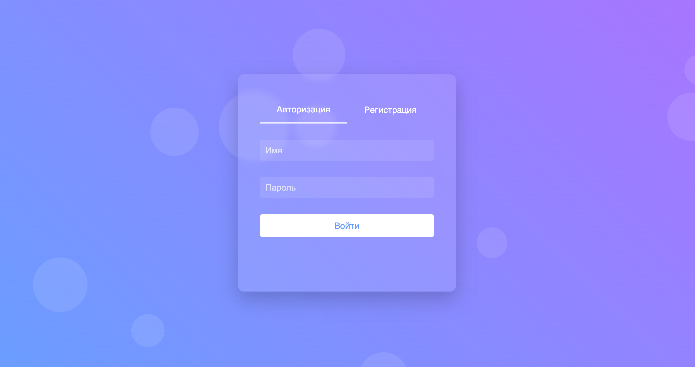
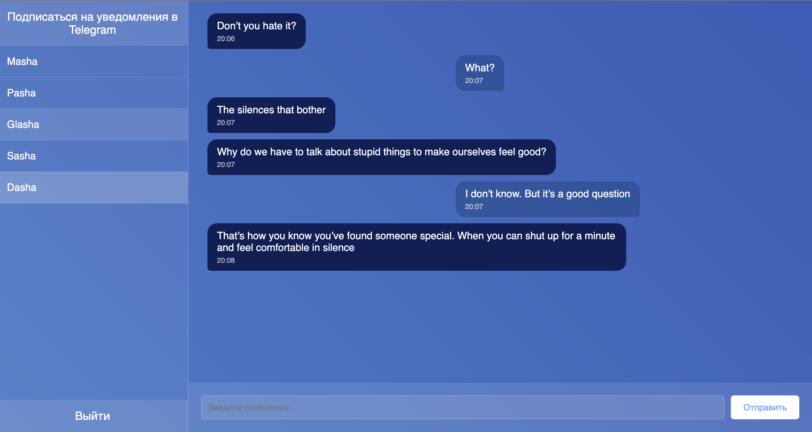

# Сервис обмена мгновенными сообщениями
 
Чат для обмена сообщениями между пользователями в реальном времени. Реализованы возможности регистрации, аутентификации, хранения истории переписки и получения уведомлений о новых сообщениях через Telegram-бота.

<div style="display: flex; gap: 10px;">
    
    
</div>


## Технологический стек

- Фреймворк **FastAPI** для разработки RESTful API.
- **WebSockets** для обмена сообщениями в реальном времени.
- **PostgreSQL** для хранения пользователей и сообщений.
- **Redis** для кэширования и хранения сессий.
- ORM **SQLAlchemy** для взаимодействия с базой данных.
- Миграции базы данных на **Alembic**.
- Telegram-бот, созданный с помощью **Aiogram**.
- **Celery** для обработки фоновых задач (отправка уведомлений через Telegram-бота).
- **Docker** для упрощения развертывания приложения.
- **Nginx** для обратного проксирования.

---

## Установка и запуск

### 1. Клонирование репозитория
```bash
git clone https://github.com/reDasha/chat_project
cd chat_project
```

### 2. Настройка переменных окружения
Создайте файл .env в корне проекта и укажите следующие переменные:
````
DB_HOST=db
DB_PORT=5432
DB_NAME=chat_db
DB_USER=postgres
DB_PASS=postgres
SECRET=<ваш секретный ключ>

POSTGRES_USER=postgres
POSTGRES_PASSWORD=postgres
POSTGRES_DB=chat_db

REDIS_URL=redis://redis:6379/0
CELERY_BROKER_URL=redis://redis:6379/0
CELERY_RESULT_BACKEND=redis://redis:6379/0

APP_HOST=0.0.0.0
APP_PORT=8000

TELEGRAM_TOKEN=<ваш_токен_бота>
````
### 3. Сборка и запуск контейнеров
Убедитесь, что на вашем компьютере установлен Docker и Docker Compose. Затем выполните:
````
docker-compose up --build
````

- Сервис доступен на http://localhost
- Документация API (Swagger) - по адресу http://localhost/docs